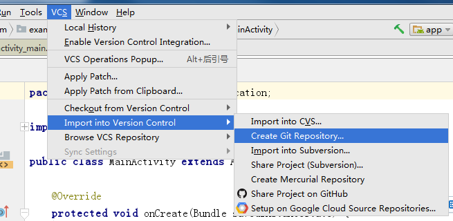
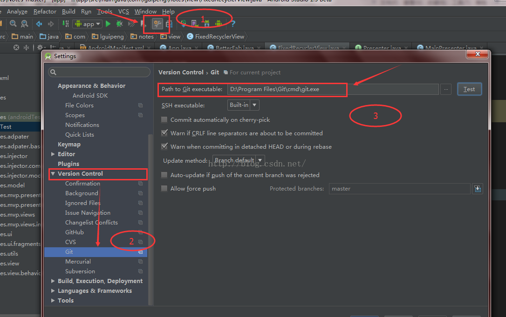
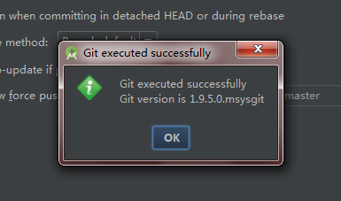
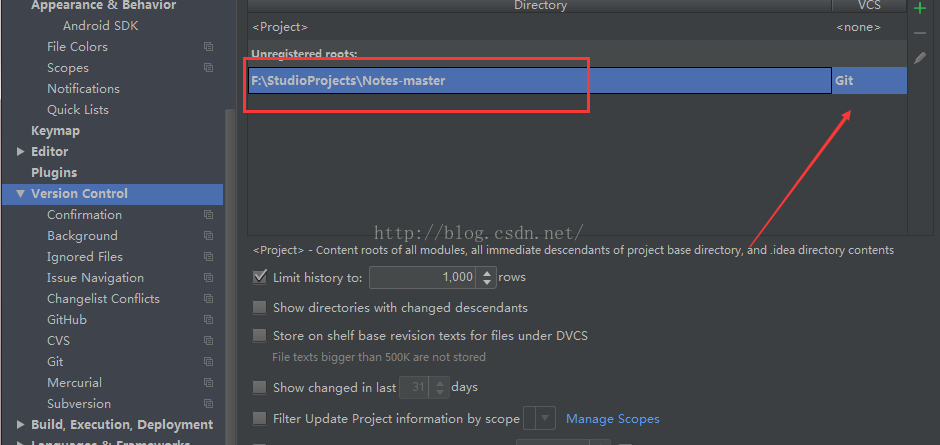
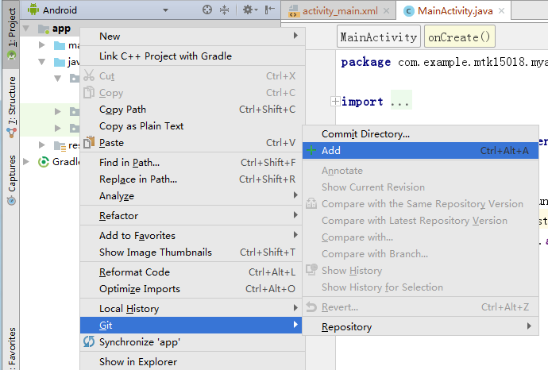
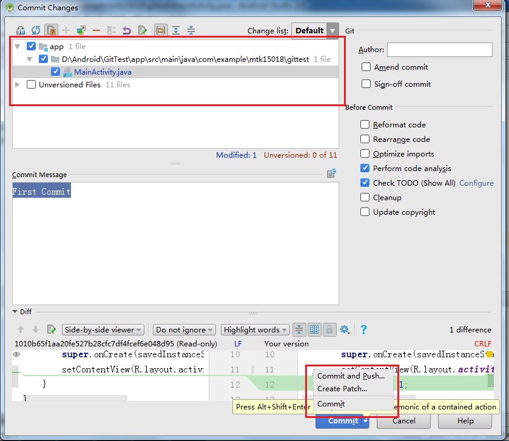
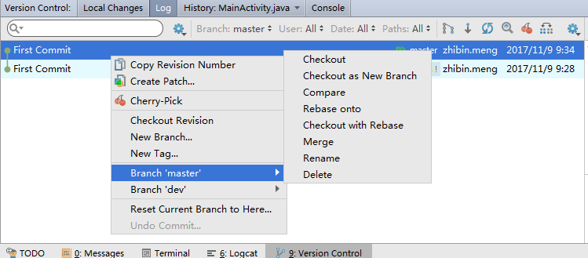
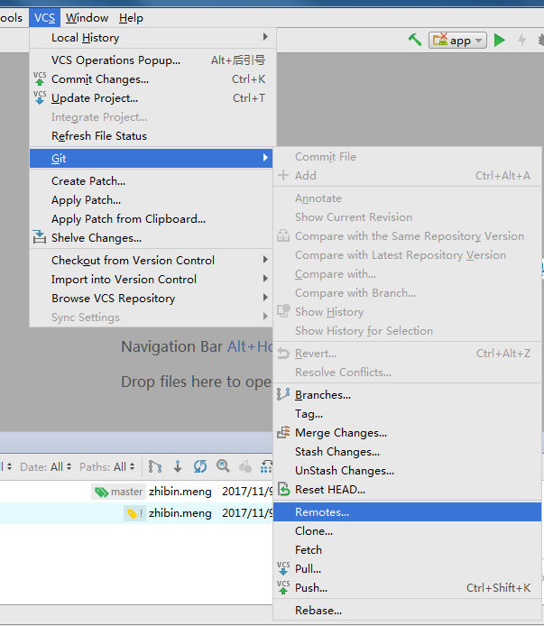
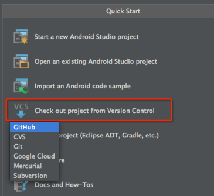

#Git On Android Studio

###1.创建仓库
打开Git Bash，进入工程当前目录，执行`git init`命令。Git Bash的安装包我已经放置在P盘，具体路径：

`P:\MSZ_DC\HSDSA1_SA5\Training\Git`。

或者直接从Android Studio环境生成

###2.配置Android Studio 环境的Git
步骤为Setting >> Version Control，将路径设置成为`git.exe`的安装路径（Git Bash的安装目录可以找到）。

配置完成后，点击`Test`按钮，出现`Success`提示框表示配置成功。

点击`Version Control`，红色箭头处选择`Git`作为版本控制工具。如果该行为灰色，点击`+`号添加仓库位置。

### 3.Add & Commit 

1. 起初，我们项目所有文件颜色，都是 [白色：正常文件的颜色]

   

   ​

2. 但是当我们为项目指定仓库路径后，所有文件颜色的颜色变了 [红色：指定仓库路径后，未Add的文件]

   

   ​

3. Add 文件，Add之后文件为绿色（未Commit）

   

4. Commit 文件，与Add相同。弹出Commit选项框，填写Commit内容和是否`Push`。

###4. 其它工具

1. Commit 之后文件编程蓝色，利用Version Control工具条查看Log，Branch，Tag，Git Log，Show Diff等。

   

2. 版本回退，新建Branch。

   

3. Pull & Merge

   

### 5.远程仓库

1. 新建仓库，参见PPT，跟普通仓库建立方式相同。

2. 与Remote仓库建立连接。

   

   弹出窗口

   

   点击`+`号

   

3. Fetch & Push & Merge

   菜单中都有相关按钮。

4. Clone

   配置GitHub账号，打开Setting>>Version Control>>Github，Auth Type选择Password，输入用户名密码，点击Test，出现Success框。

   

5. 主界面直接Clone仓库，也可以菜单栏VCS>>Checkout from Version Control>>Github，进入Clone代码。

   

   ​

6. Clone代码，从弹框中填入仓库地址和相关地址。

   

### 6.网上资源

更进一步的使用请参照以下网址：http://blog.csdn.net/gao_chun/article/details/49817267